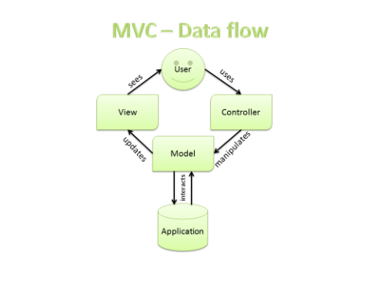

# PHP MVC

*```Model-View-Controller (MVC)``` é um padrão, formulado originalmente no final dos anos 70.<br>
 É um <strong>padrão de design de aplicações</strong> que separa os dados da aplicação e a lógica de negócio<br> 
```(Model)```, da apresentação ```(View)```. O controlador ```(Controller)``` intermedia entre o Model e as Views.<br>
As vantagens desta arquitetura é reutilização de códigos, segurança de dados e melhor desempenho da aplicação.*

### Representação visual do fluxo de dados da arquitetura MVC




## Model

*O ```Model``` é o nome dado ao componente que se comunicará com o banco de dados para manipular os dados.*

## View

*A view é responsável por exibir os dados fornecidos pelo Model em um formato específico.<br>
É responsável por mapear gráficos em um dispositivo. Uma exibição que se conecta a um ```Model```<br>
e torna seu conteúdo disponivel, formatando os dados a serem apresentados ao usuário, em uma aplicação web<br> com uma saída html.*

## Controller

*Um ```Controller``` é o meio pelo qual o usuário interage com a aplicação. Um ```Controller```<br>
aceita a entrada de usuário e instrui o ```Model``` e a ```View``` na execução de ações com base nessa<br> entrada. Ele lida com o ```Model``` e verifica camadas para trabalhar em conjunto.<br>
O ```Controller``` recebe uma solicitação do cliente, invoca o ```Model``` para realizar as operações<br> solicitadas e envia os dados para a View.<br>
O ```Controller``` é responsável por mapear a ação do usuário final para a resposta da aplicação.*


